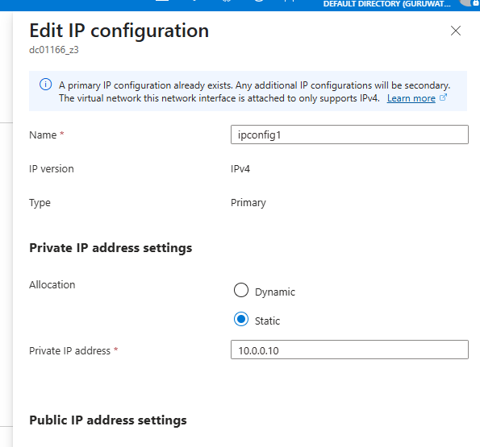
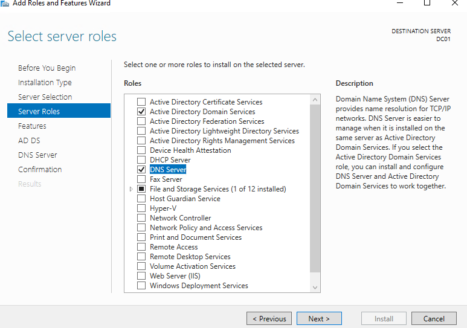
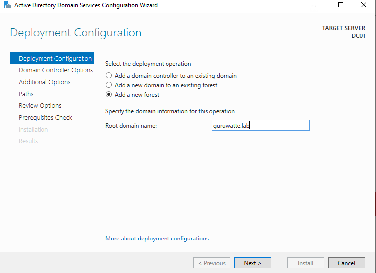
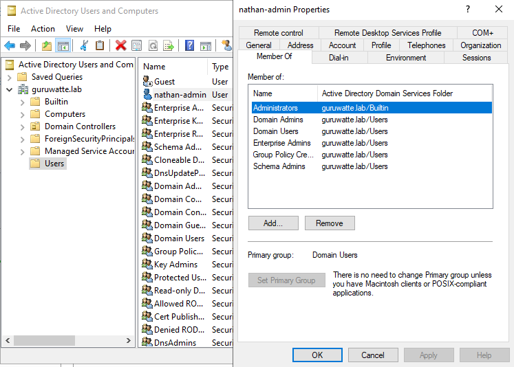

# Project 1 – Active Directory Domain Setup

## Overview

This project involved deploying a Windows Server 2022 virtual machine in Azure and promoting it to a domain controller in a new Active Directory forest (`guruwatte.lab`). This is the first step in building out a simulated enterprise environment for hands-on systems administration practice.

## Key Steps

- Deployed a Windows Server 2022 VM in Azure (B2s SKU)
- Assigned a static private IP address (`10.0.0.10`) using the Azure portal (NIC settings)
- Installed the Active Directory Domain Services and DNS Server roles
- Promoted the server to a domain controller and created the forest `guruwatte.lab`
- Created and logged in with the domain admin account `guruwatte\nathan-admin`
- Verified the domain setup using Active Directory Users and Computers (ADUC) and DNS Manager

## Mistake and Recovery: Static IP Configuration

Initially, I tried to manually set the static IP address from within the VM using the IPv4 adapter settings. This caused the RDP session to drop, and I lost connectivity.

After researching, I realized that in Azure, static IP addresses should be assigned through the VM's network interface in the Azure portal, not inside the operating system. Azure expects the VM's adapter to remain on DHCP while the reserved IP is enforced at the platform level.

I resolved the issue by:
- Setting the static IP (`10.0.0.10`) on the NIC in Azure (ipconfig1)
- Rebooting the VM
- Regaining RDP access without changing the NIC inside the VM

**Screenshot – Static IP Settings:**  

## Warnings Observed During Promotion

- **Static IP Warning**: The promotion wizard warned that no static IP was assigned. This is expected when the NIC is configured via Azure and the VM uses DHCP.
- **DNS Delegation Warning**: Another expected warning when creating a new forest without an existing parent DNS domain.
- **Disk Write Cache Warning**: The wizard noted that disk write caching could not be disabled on the C: drive. This is normal for Azure VMs and does not impact functionality.

**Screenshot – AD DS Role Selection:**  

**Screenshot – Domain Controller Promotion Wizard:**  

## Domain Verification

- Confirmed domain name: `guruwatte.lab`
- Verified `nathan-admin` as a member of the `Domain Admins` group
- Confirmed DNS zone was created for `guruwatte.lab`
- RDP login successful using `guruwatte\nathan-admin`
- `Get-ADDomain` and `dcdiag` returned healthy results
- ADUC and DNS Manager both showed expected domain structure

**Screenshot – Active Directory Users and Computers:**  

## Skills Demonstrated

- Windows Server 2022 setup and configuration
- Azure virtual networking (static IP reservation, VM recovery)
- Active Directory and DNS role installation
- Troubleshooting failed RDP access and recovering from misconfiguration
- Interpreting and responding to common AD DS deployment warnings
