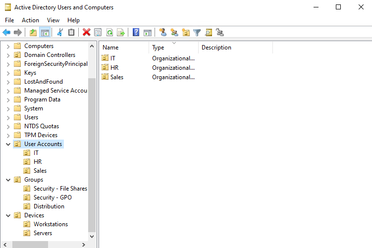
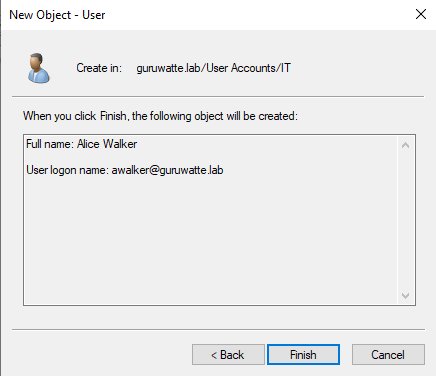
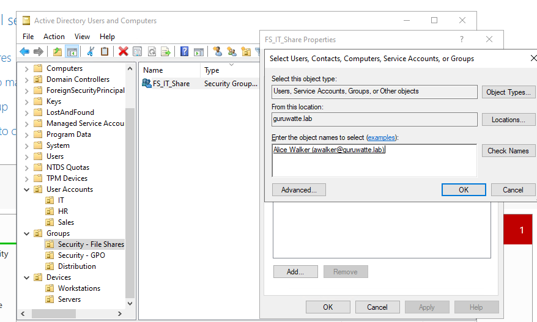
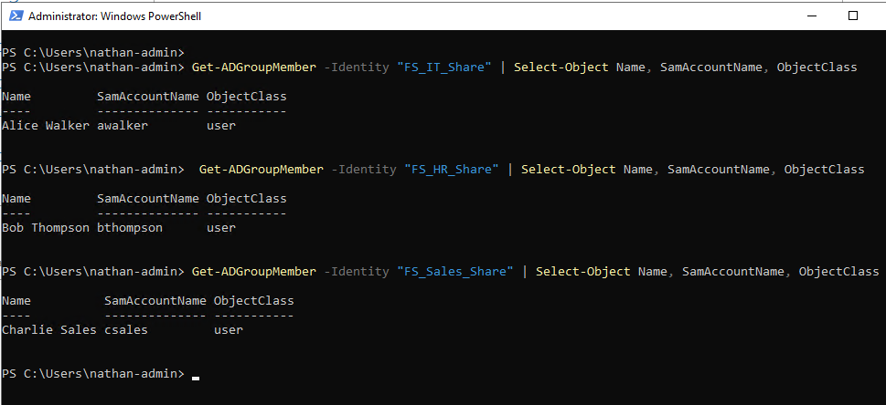

# Project 2 – User, Group, and OU Management

## Overview

In this project, I created a realistic Active Directory organizational structure within my lab domain (`guruwatte.lab`) using Organizational Units (OUs), user accounts, and security groups. This foundational work prepares the environment for clean group policy targeting and secure role-based access in later projects.

---

## OU Structure

To avoid conflicts with the default `Users` and `Computers` containers, I created custom OUs for user accounts, groups, and devices.

Final structure:

```
guruwatte.lab
├── User Accounts
│   ├── IT
│   ├── HR
│   └── Sales
│
├── Groups
│   ├── Security - File Shares
│   ├── Security - GPO
│   └── Distribution
│
├── Devices
│   ├── Workstations
│   └── Servers
```

**Screenshot – OU Structure in ADUC:**  


---

## User Accounts Created

I created one user account per department using the ADUC GUI and placed each in the appropriate OU.

| Name            | Username     | OU                 |
|-----------------|--------------|--------------------|
| Alice Walker    | awalker      | User Accounts\IT   |
| Bob Thompson    | bthompson    | User Accounts\HR   |
| Charlie Sales   | csales       | User Accounts\Sales|

**Screenshot – New User (Alice Walker) being created:**  


---

## Security Groups

I created one security group per department to simulate role-based file share access:

- `FS_IT_Share`
- `FS_HR_Share`
- `FS_Sales_Share`

Each user was added to their department’s group manually via ADUC.

**Screenshot – Adding Alice Walker to FS_IT_Share:**  


---

## PowerShell Verification

I ran the following command for each group to confirm members were added successfully:

```powershell
Get-ADGroupMember -Identity "FS_IT_Share" | Select-Object Name, SamAccountName, ObjectClass
```

This was repeated for `FS_HR_Share` and `FS_Sales_Share`. The output verified that each user was correctly added to their group.

**Screenshot – PowerShell verification of group memberships:**  


---

## Skills Demonstrated

- OU design for scalable AD structure
- User account provisioning in Active Directory
- Security group creation and access modeling
- GUI-based AD administration using ADUC
- PowerShell verification of AD group membership

---

This structure sets the foundation for clean group policy targeting in the next project. I'm treating each project as a building block toward a complete, real-world sysadmin environment.
